# OutPACK

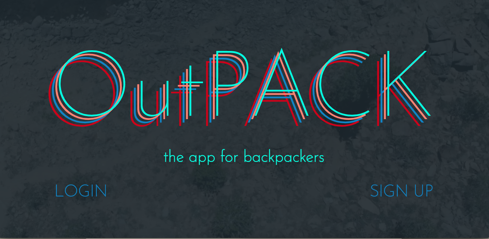

## Scope:
OutPACK is an app that allows users to plan, log and share all of their outdoor backpacking adventures in one place!

## Getting Started:
To run OutPACK on your local machine...

1. Make sure you have the following downloaded on your machine:

 * Python (https://www.python.org/downloads/):
   * `brew install python3`

 * PostGIS (https://postgis.net/install/):
   * `brew install postgis`
  

 2. Clone this repository, then:
  
  * Install requirements:
    * `pip3 install -r requirements.txt`

 * Make migrations:
   * `python3 manage.py makemigrations`
   * `python3 manage.py migrate`
   * `python3 manage.py runserver`

## Built With:

* Django/Python

* Javascript/JQuery

* HTML/CSS/SASS

* PostgreSQL/PostGIS

## Third Party Apps:

* crispy_forms

* mapwidgets

* social_django

## Users:
Our user is someone who enjoys the outdoors, traveling, planning, keeping track of memories, & sharing and receiving ideas for their next adventure. 

## Features:
* User signup, login, logout
* User profile create & edit
* Upload profile picture (default picture provided if left blank)
* View other user's profiles (if user selected "public" privacy setting)
* Create, edit, delete a new trip
  * Displays name of trail, permit info (optional), dates of trip, length of trip,a map of the location of the trip, and a section to plan what gear and food  to pack 
  * Users can select a point on a map to store the location of their trip
  * Users can add trip events to their Calendar via ics file
* Create, edit, delete posts about trips
  * Upload photos, videos or write about your trip after you get back
* Explore page allows users to view other user's trips to get ideas for their next adventure
* Users can share trips and posts with friends and family on Facebook 
* Users can determine privacy settings
  * If their profile is private, then their trips and profile will not be displayed in the explore page for other users the see
* Pretty URLs
* Google Authentication

## User Story: 
* A user will visit our landing where they have an option to sign-in or sign up
 * A first-time user will select the ‘sign up’ link which will bring them to a form that requests a username and password, which then goes through validation and confirmation before advancing 
  * When preliminary sign-up data is submitted, the user will be redirected to a profile page where they can create a profile customized with a profile picture, bio (optional), and current city (optional) information 
* If the user selects the  ‘sign-in’ button, they will be redirected to their profile page
 * Users can select icons from the nav bar containing links to:  
  * Profile: 
    * A user’s profile page showing their information and a map displaying pins from all of the trips they have taken
  * Trips:
    * Displays all of the user's trips, both completed and upcoming
  * Start a New Trip:
    * User can create a trip by entereing a trail name, permit info (optional), dates, whether the trip has been completed, and the specific location by placing a marker on a map 
  * Explore:
    * Users can explore the trip database to see where other users have gone to get ideas for their next adventure
    * Trips are displayed as markers on a map and when clicked, display the trial name (links to trip detail page), name of the user who took the trip (links to profile page of user), and  the dates of the trip. 
  * Logout:
    * User can logout and will be redirected to the landing page
  
## Screenshots:

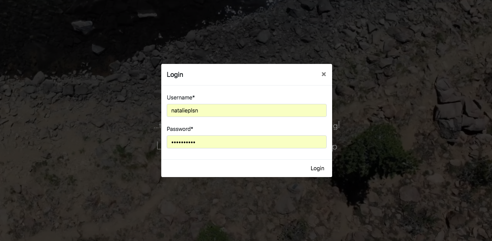

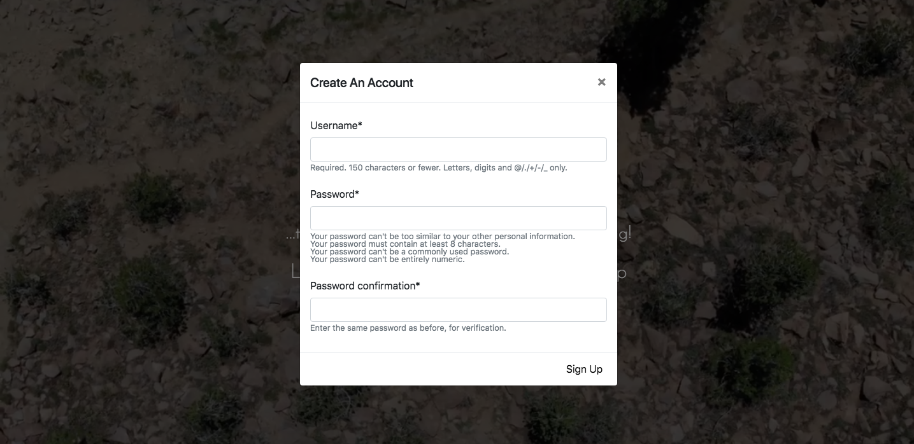

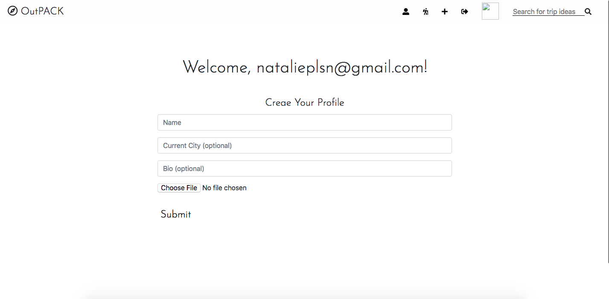

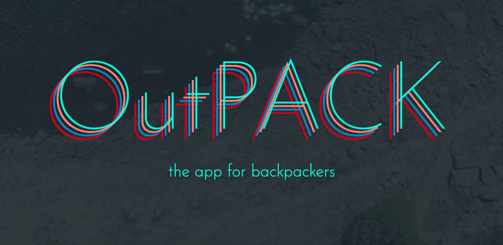

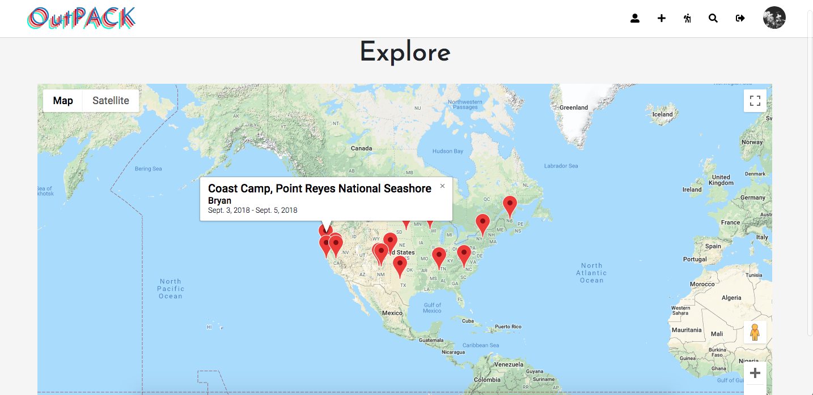

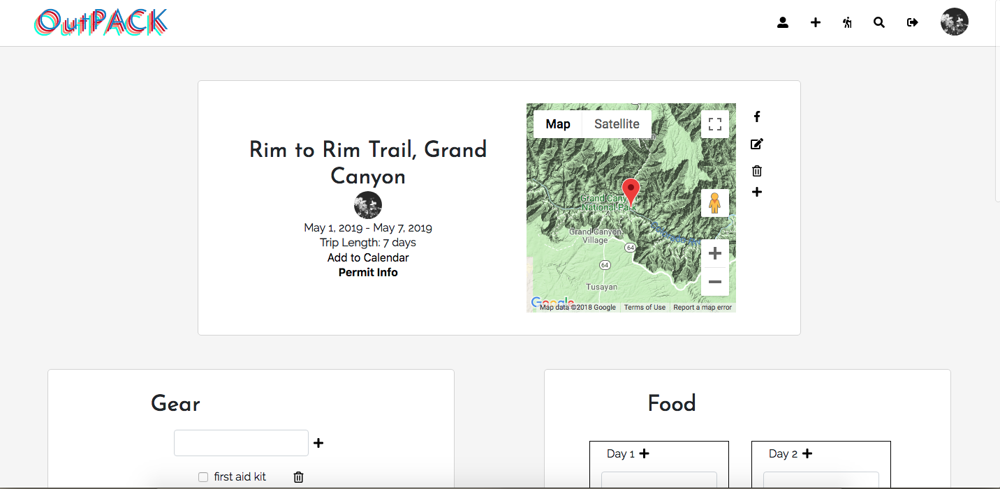

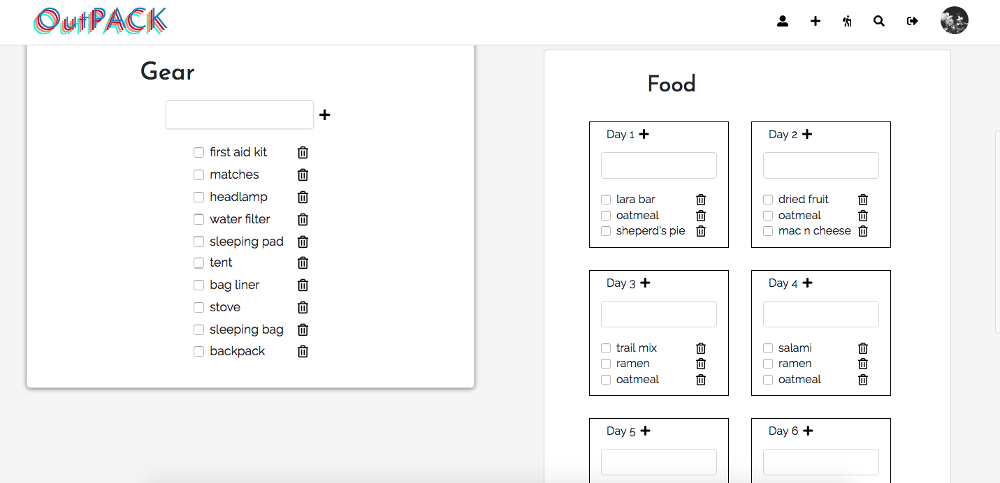

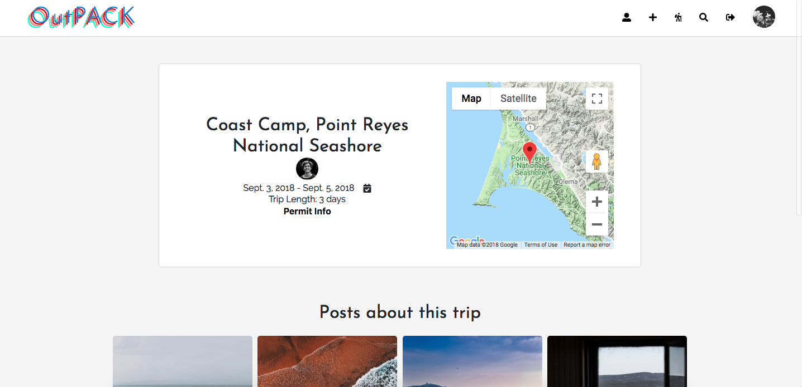

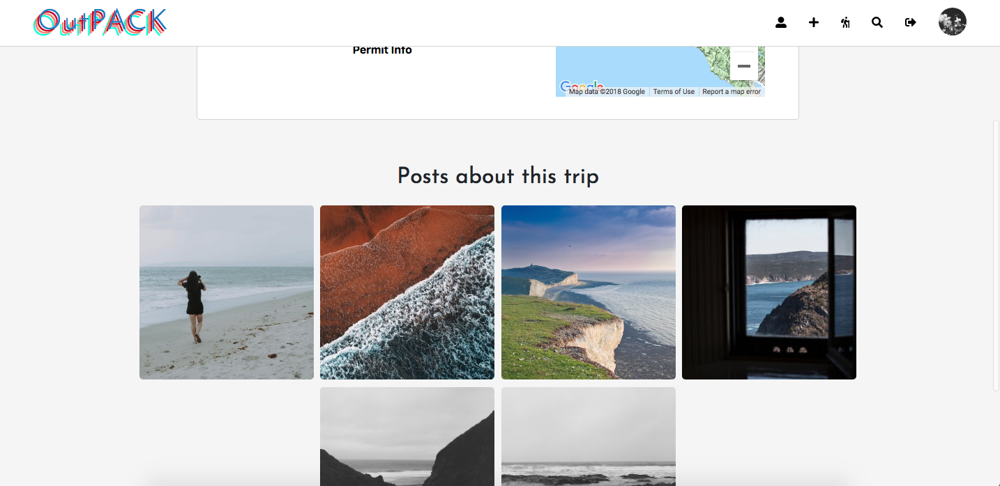

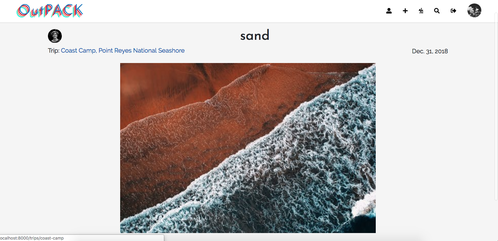

## Unsolved Problems...
* Modal glitches and design challenges with Django forms
* Make delete confirmation notices more elegant
* Redesign trips page
* Make responsive
* Add latitude and longitude to calendar trip events
* ~~Figure out default profile picture location so not ignored~~ completed 11/21/2018
* ~~Google Maps Widget on load isn't correct size~~ completed 12/4/2018
* ~~Add logic to check trip date and automatically change status of trip complete if date has passed~~ completed 11/21/2018

## Still to Come...
* Add an about page
* Add a contact page
* Allow user's to draw lines (instead of a point) to capture their trip more precisely, especially useful for section hiking
* Allow users to add collaborators to a trip, allowing for mutual editing/editing/memory storing
* Refactor to React
* Clean up Sass code
* Add commenting
* Add likes
* Add follows and a feed page
* Add friends list to profile page
* ~~Allow user's to upload videos~~ completed 12/04/2018
* ~~Enable Google Authentication~~ completed 12/10/2018
* ~~Allow users to add to their calendar via ICS files~~ completed 12/18/2018 
* ~~Allow user's to break food planning down by day~~ completed 12/07/2018
* ~~Allow user's to opt out of sharing their trips and/or profile with other users~~ completed 12/07/2018
* ~~Display a map on each user's profile page that displays pins from all of their completed trips~~ completed 12/07/2018
* ~~Display maps on each trip page to show the general location of the trip~~ completed 12/07/2018
* ~~Change search page to an explore page, showing a map with pins linking to trips~~ completed 12/07/2018

## Links:

### Wireframes/Project Planning
* [OutPACK](OutPACK.pdf)

### Created By
* [Natalie Poulson](https://github.com/natalie-poulson)
